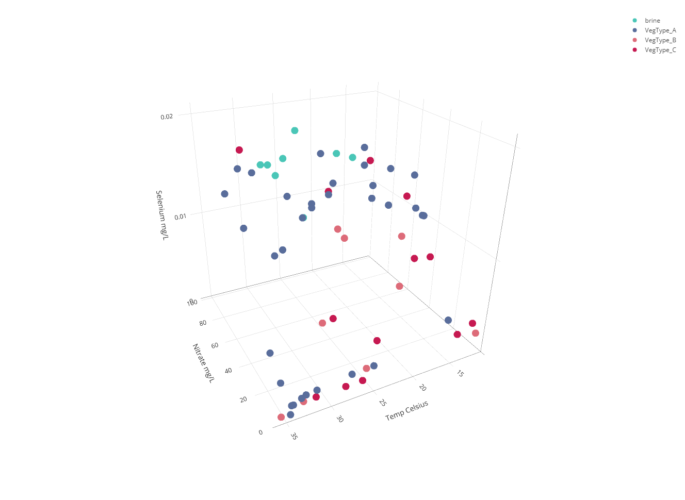
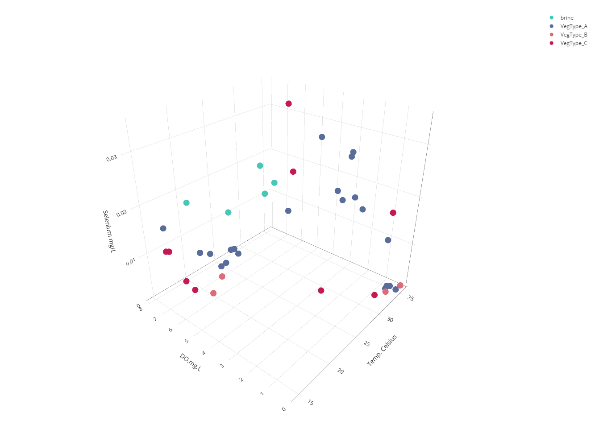
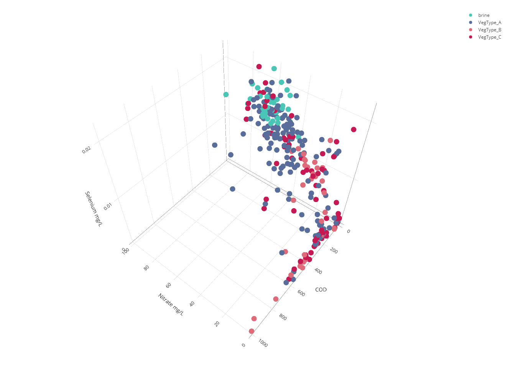
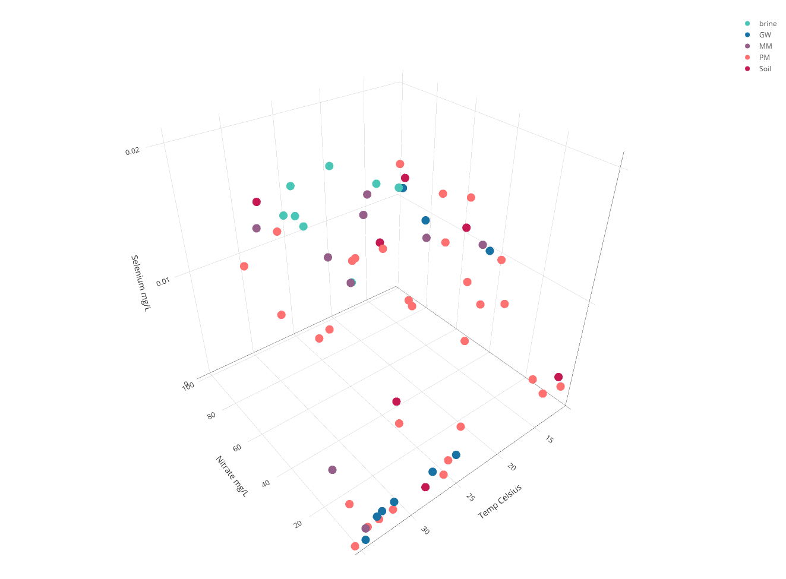
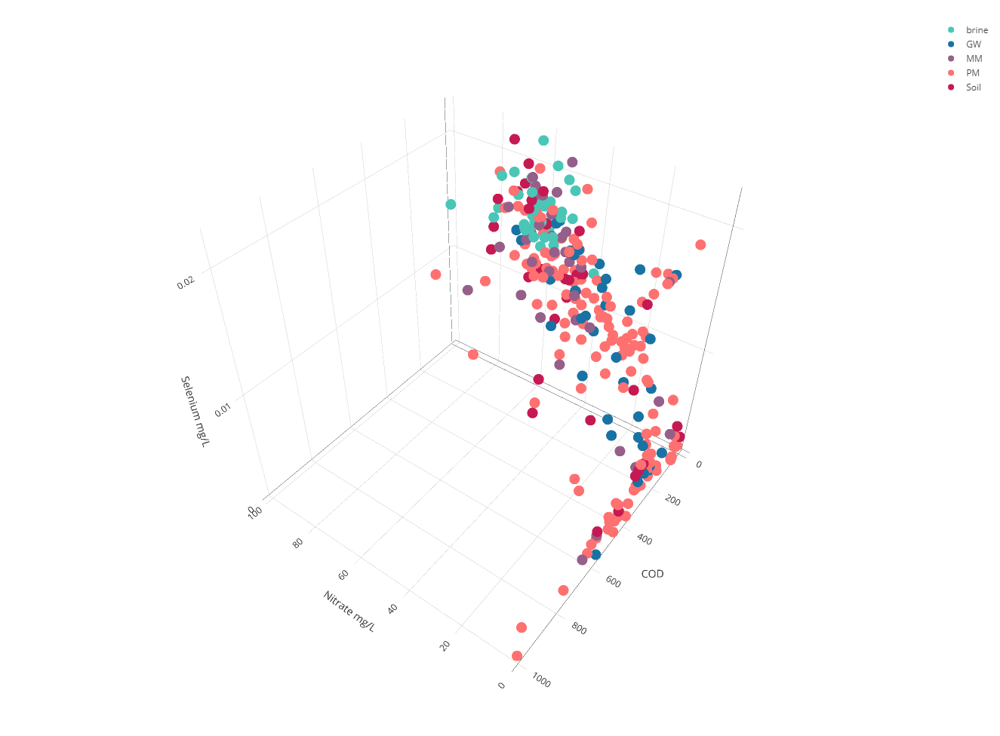
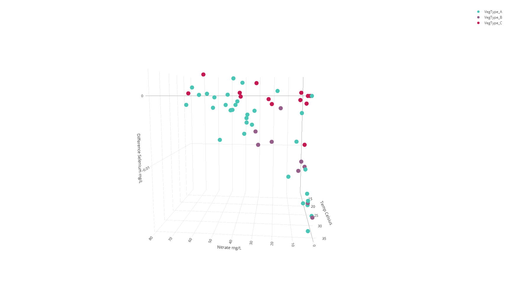
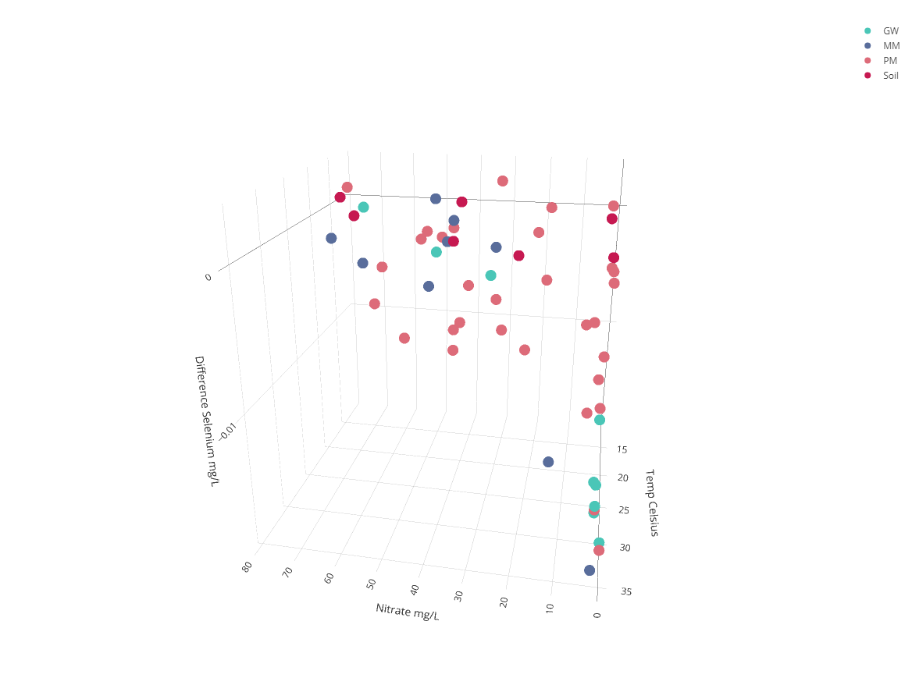
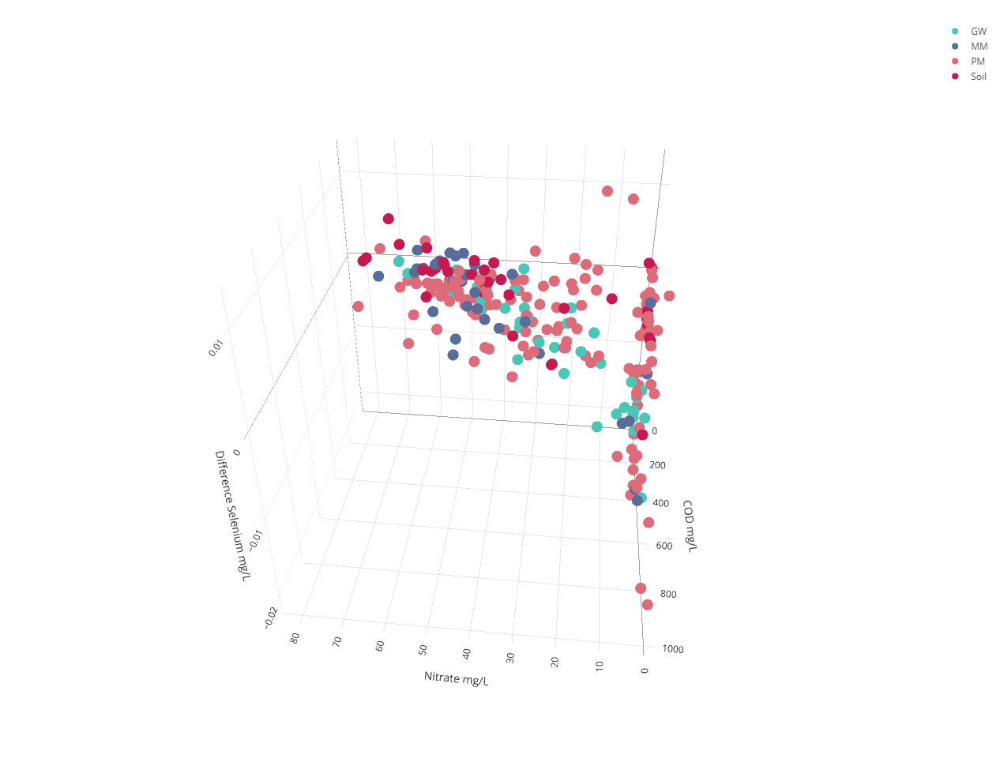

```{r setup, include=FALSE}
knitr::opts_chunk$set(echo = TRUE)
#knitr::opts_chunk$set(error = TRUE)
```

```{r load-packages, message=FALSE,warning=FALSE}
library(tidyverse); theme_set(theme_minimal())
theme_update(panel.grid.minor = element_blank())
library(lubridate)
library(rcartocolor)
library(RColorBrewer)
library(viridis)
library(scales)
library(rstatix)
library(dplyr)
library(ggpubr)
library(leaps) #For Best Subset
library(plotly) #for 3D plots
library(fields)
library(here) #Optional for loading files. 
#   If library not install, call it by here::here(). If installed, just here().
library(webshot) #for knitting html output into pdf

```

Authors:  
Ivan Ko  
Blake Loosley  
Lauren Varnado  

# MoWater

\begin{center}
Goodyear Artificial Wetland Project
\end{center}

```{r file_loading1, echo=FALSE, warning=FALSE}
#NOTE: If here::here() doesn't work. Install and load the library("here") 
#   package,and replace here::here() with just here().
load(here::here("clean", "goodyearMoWater0.rda" ))
load(here::here("clean", "cleanedObjects.rda" ))
load(here::here("clean", "cleanedFactors.rda" ))
load(here::here("clean", "complete_cases.rda" ))
```

## 1. Setting Important Dates 
```{r Set_Key_Dates, warning=FALSE, message=FALSE}
#train change date: relevant for bin 2 and 4. 
#Before the change, bin 2 is train 3,
#This can be our starting date since we will only be ignoring 8 months of data.
trainChangeDate <- ymd( "2011-06-15")

#unstable periods
unstablePeriodStart <- ymd( "2014-04-01")
unstablePeriodEnd <- ymd( "2016-01-01") #rough est. according to Katie (stakeholder)

#Note: 2015-04-01 may be set to 2015-01-01 because the data doesn't look right.
#There's a spike in data around Jan 2015 that should be grouped with the next 
# performance period,hence this choice.

#set periods: most bins have different perfmance periods!
#bin1, 5, 6, 7
bin1567Period1End <- ymd( "2012-03-01")
bin1567Period2End <- ymd( "2015-04-01")
bin1567Period3End <- ymd( "2017-04-01")
bin1567Periods <- c(bin1567Period1End, bin1567Period2End, bin1567Period3End)

#periods for bin2
bin2Period1End <- ymd( "2015-04-01")
bin2Period2End <- ymd( "2017-04-01")
bin2Periods <- c(bin2Period1End, bin2Period2End)

#periods for bin3, bin4
bin34Period1End <- ymd( "2015-04-01")
bin34Period2End <- ymd( "2016-12-01")
bin34Periods <- c(bin34Period1End, bin34Period2End)
```

## 2. Exploratory Analysis   
### 2.1 Boxplot on Bin Selenium level

```{r Boxplot, warning=FALSE,message=FALSE}
#different boxplot grouped by train type
dfTest <- dfDataSel
dfTest$ID <- factor(dfTest$ID , levels=c("Bin1", "Bin5", "Bin7", "Bin2", 
                                         "Bin6", "Bin4", "Bin3", "brine"))

boxSelTCGroup <- dfTest %>%
    ggplot(aes(x = ID, y = Selenium)) +
    geom_boxplot(fill = c("#D95F02", "#D95F02", "#D95F02", 
                          "darkgreen", "darkgreen", "royalblue3", 
                          "red3", "black")) +
    xlab("Train Type") +
    ylab("Selenium Content (mg/L)") +
    labs(title= "Boxplot: Selenium by Effluent by Train") +
    theme(legend.position = "none", axis.text=element_text(size=14))

boxSelTCGroup
```

In this Boxplot,  it is shown that Bin 3 and Bin 1 have a small range with most   
of the data occurring well above the Selenium threshold. However, there are  a   
couple outliers that produce more successful Selenium concentrations.   
Additionally, Bin 2 and Bin 6 have the most consistently low Selenium   
concentration values compared to the other bins. In other words, Bins 2 and 6   
appear to be the only bins that are skewed towards higher values whereas the   
other bins are skewed toward the lower values. At face value, it appears that   
Bins 2 and 6 seem to be the best for removing Selenium since they have the   
lowest medians.

### 2.2 Estimated Marginal Means Testing
```{r}
#ANOVA
#Uses library(emmeans)
#test for homogeneity; compares the behavior (slope) with the addition of covariate

#-- by Bin --

#COD vs sel
anoSelvCOD <- anova_test(Selenium ~ COD * ID, data = dfDataSel)
get_anova_table(anoSelvCOD)
# maybe covariant! p = .1

#COD + Temp vs sel
anoSelvCODT <- anova_test(Selenium ~ (COD + Temp..Celsius) * ID, data = dfDataSel)
get_anova_table(anoSelvCODT)
# maybe covariant! p = .306

#pH vs sel
anoSelvpH <- anova_test(Selenium ~ pH * ID, data = dfDataSel)
get_anova_table(anoSelvpH)
# is covariant! p = 0.469

#T vs sel
anoSelvT <- anova_test(Selenium ~ Temp..Celsius * ID, data = dfDataSel)
get_anova_table(anoSelvT)
# is covariant! p = 0.45

#DO vs sel
anoSelvDO <- anova_test(Selenium ~ DO.mg.L * ID, data = dfDataSel)
get_anova_table(anoSelvDO)
# highest is covariant! p = 0.67

#Nit vs Sel
anoSelvNit <- anova_test(Selenium ~ Nitrate * ID, data = dfDataSel)
get_anova_table(anoSelvNit)
#P is low so it's bad = = 1.15e-7

#Phosphorus vs Sel
anoSelvPho <- anova_test(Selenium ~ Phosphorus * ID, data = dfDataSel)
get_anova_table(anoSelvPho)
# maybe is covariant! p = 0.21

#-- by veg --

# DO test but for veg type
anoSelvDOVeg <- anova_test(Selenium ~ DO.mg.L * Veg, data = dfDataSel)
get_anova_table(anoSelvDOVeg)
# p = 0.986

#pH test but for veg type
anoSelvpHVeg <- anova_test(Selenium ~ pH * Veg, data = dfDataSel)
get_anova_table(anoSelvpHVeg)
# p = 0.187!

#COD test but for veg type
anoSelvCODVeg <- anova_test(Selenium ~ COD * Veg, data = dfDataSel)
get_anova_table(anoSelvCODVeg)
# p > 0.7

#T test but for veg type
anoSelvTVeg <- anova_test(Selenium ~ Temp..Celsius * Veg, data = dfDataSel)
get_anova_table(anoSelvTVeg)
# p = 0.35

#Nit test but for veg type
anoSelvNitVeg <- anova_test(Selenium ~ Nitrate * Veg, data = dfDataSel)
get_anova_table(anoSelvNitVeg)
# p = 0.02

#Phosphorus test but for media type
anoSelvPhoVeg <- anova_test(Selenium ~ Phosphorus * Veg, data = dfDataSel)
get_anova_table(anoSelvPhoVeg)
# p = 0.04

#-------------------------------------

#-- by train -- 

# DO test but for train type
anoSelvDOTrain <- anova_test(Selenium ~ DO.mg.L * TrainGroup, data = dfDataSel)
get_anova_table(anoSelvDOTrain)
# p > 0.459!

#pH test but for train type
anoSelvpHTrain <- anova_test(Selenium ~ pH * TrainGroup, data = dfDataSel)
get_anova_table(anoSelvpHTrain)
# p = 0.57!

#COD test but for train type
anoSelvCODTrain <- anova_test(Selenium ~ COD * TrainGroup, data = dfDataSel)
get_anova_table(anoSelvCODTrain)
# p > 0.069

#T test but for train type
anoSelvTTrain <- anova_test(Selenium ~ Temp..Celsius * TrainGroup, data = dfDataSel)
get_anova_table(anoSelvTTrain)
# p = 0.24

#Nit test but for train type
anoSelvNitTrain <- anova_test(Selenium ~ Nitrate * TrainGroup, data = dfDataSel)
get_anova_table(anoSelvNitTrain)
# p = 4.14e-9

#Phosphorus test but for train type
anoSelvPhoTrain <- anova_test(Selenium ~ Phosphorus * TrainGroup, data = dfDataSel)
get_anova_table(anoSelvPhoTrain)
# p = 0.1

#--- by Media ---

# DO test but for media type
anoSelvDOMedia <- anova_test(Selenium ~ DO.mg.L * MediaType, data = dfDataSel)
get_anova_table(anoSelvDOMedia)
# p > 0.825!

#pH test but for media type
anoSelvpHMedia <- anova_test(Selenium ~ pH * MediaType, data = dfDataSel)
get_anova_table(anoSelvpHMedia)
# p = 0.81.

#COD test but for media type
anoSelvCODMedia <- anova_test(Selenium ~ COD * MediaType, data = dfDataSel)
get_anova_table(anoSelvCODMedia)
# p > 0.95

#T test but for media type
anoSelvTMedia <- anova_test(Selenium ~ Temp..Celsius * MediaType, data = dfDataSel)
get_anova_table(anoSelvTMedia)
# p = 0.115

#Nit test but for media type
anoSelvNitMedia <- anova_test(Selenium ~ Nitrate * MediaType, data = dfDataSel)
get_anova_table(anoSelvNitMedia)
# p = 0.99!!!

#Phosphorus test but for media type
anoSelvPhoMedia <- anova_test(Selenium ~ Phosphorus * MediaType, data = dfDataSel)
get_anova_table(anoSelvPhoMedia)
# p = 0.33


dfDataSel$MediaType <- as.character(dfDataSel$MediaType)
emmeans_test(Selenium ~ MediaType, covariate = Temp..Celsius, p.adjust.method = "bonferroni", data = dfDataSel)
emmeans_test(Selenium ~ MediaType, p.adjust.method = "bonferroni", data = dfDataSel)

dfDataSel$Veg <- as.character(dfDataSel$Veg)
emmeans_test(Selenium ~ Veg, covariate = Temp..Celsius, data = dfDataSel)
emmeans_test(Selenium ~ Veg, p.adjust.method = "bonferroni", data = dfDataSel)

dfDataSel$ID <- as.character(dfDataSel$ID)
BinControlTemp <- emmeans_test(Selenium ~ ID, covariate = Temp..Celsius, p.adjust.method = "bonferroni", data = dfDataSel)
BinContorlNone <- emmeans_test(Selenium ~ ID, p.adjust.method = "bonferroni", data = dfDataSel)
```

    Estimated Marginal Means tests were run on available categorical variables to examine  the effect of different covariates. One thought when identifying covariates was to find the least significant interaction terms and use those as covariates, but it was important to identify which variables the stakeholders can actually control. Most of the variables that would make good covariates, eg. Nitrate and DO, were mostly responsive to the system and couldn’t be controlled so instead used Temperature as a covariate since it was an external factor collected in the dataset.
    Primary findings from these tests showed that when controlling for temperature, there are no significant differences between the mean selenium content of the different Media Types and there was one significant difference between Vegetation Types, specifically the mean for Vegetation Type A is higher than the mean for Vegetation Type B. When controlling for Temperature, Bin 2, Bin 4 and Bin 6 all have significantly lower means than Brine, and Bins 2 and 6 have significantly lower means than Bin 3.

### 2.3 3D Plots 
```{r plot3D_Temp_Veg, warning=FALSE, eval=FALSE}
#NOTE: This code is NOT run here when knitting due to the html output issue.

#Set color here
colorsScale <- c('#4AC6B7', '#1972A4', '#965F8A', '#FF7070', '#C61951')

#Temp vs Nit on Veg
fig <- plot_ly(dfT, x = ~Nitrate, y = ~Temp..Celsius, 
               z = ~Selenium, color = ~Veg, colors = colorsScale)
fig <- fig %>% add_markers()
fig <- fig %>% layout(scene = list(xaxis = list(title = 'Nitrate mg/L'),
                                   yaxis = list(title = 'Temp Celsius'),
                                   zaxis = list(title = 'Selenium mg/L')))
fig

#---

#Temp vs DO on Veg
figTDOV <- plot_ly(dfT, x = ~Temp..Celsius, y = ~DO.mg.L, 
                   z = ~Selenium, color = ~Veg, colors = colorsScale)
figTDOV <- figTDOV %>% add_markers()
figTDOV <- figTDOV %>% layout(scene = list(xaxis = list(title = 'Temp. Celsius'),
                                           yaxis = list(title = 'DO.mg.L'),
                                           zaxis = list(title = 'Selenium mg/L')))
figTDOV

#---

#Temp vs COD
figTCV <- plot_ly(dfT, x = ~Temp..Celsius, y = ~COD, 
                  z = ~Selenium, color = ~Veg, colors = colorsScale)
figTCV <- figTCV %>% add_markers()
figTCV <- figTCV %>% layout(scene = list(xaxis = list(title = 'Temp. Celsius'),
                                         yaxis = list(title = 'COD mg/L'),
                                         zaxis = list(title = 'Selenium mg/L')))
figTCV
```




When high Temperature is coupled with low Nitrate or DO, Selenium tends to be   
low. But COD doesn't have a clear correlation with Selenium level. 

```{r plot3D_Media, warning=FALSE, eval=FALSE}
#Temp vs Nit on Media
figM <- plot_ly(dfT, x = ~Nitrate, y = ~Temp..Celsius, 
               z = ~Selenium, color = ~MediaType, colors = colorsScale)
figM <- figM %>% add_markers()
figM <- figM %>% layout(scene = list(xaxis = list(title = 'Nitrate mg/L'),
                                   yaxis = list(title = 'Temp Celsius'),
                                   zaxis = list(title = 'Selenium mg/L')))
figM

#---

#Nit vs COD on Media
figNCM <- plot_ly(dfT, x = ~Nitrate, y = ~COD, 
                 z = ~Selenium, color = ~MediaType, colors = colorsScale)
figNCM <- figNCM %>% add_markers()
figNCM <- figNCM %>% layout(scene = list(xaxis = list(title = 'Nitrate mg/L'),
                                       yaxis = list(title = 'COD'),
                                       zaxis = list(title = 'Selenium mg/L')))
figNCM
```



In general, Media Type seems to be affected by variables in a similar way to   
Vegetation except for Soil type. Soil Type Media is more resistant to changes in  
the environment than other Media Types. 

```{r Difference_Selenium_3D_plot, eval=FALSE, warning=FALSE}
#Diff Nit and Temp on Veg
figNTVD <- plot_ly(dfD, x = ~Nitrate, y = ~Temp..Celsius, 
                 z = ~diff_Selenium, color = ~Veg, colors = colorsScale)
figNTVD <- figNTVD %>% add_markers()
figNTVD <- figNTVD %>% layout(scene = list(xaxis = list(title = 'Nitrate mg/L'),
                                     yaxis = list(title = 'Temp Celsius'),
                                     zaxis = list(title = 'Difference Selenium mg/L')))
figNTVD

#---

#Diff Nit and Temp on Media
figNTMD <- plot_ly(dfD, x = ~Nitrate, y = ~Temp..Celsius, 
                 z = ~diff_Selenium, color = ~MediaType, colors = colorsScale)
figNTMD <- figNTMD %>% add_markers()
figNTMD <- figNTMD %>% layout(scene = list(xaxis = list(title = 'Nitrate mg/L'),
                                         yaxis = list(title = 'Temp Celsius'),
                                         zaxis = list(title = 'Difference Selenium mg/L')))
figNTMD

#---

#Diff Nit vs COD on Media
figNCMD <- plot_ly(dfD, x = ~Nitrate, y = ~COD, 
                  z = ~diff_Selenium, color = ~MediaType, colors = colorsScale)
figNCMD <- figNCMD %>% add_markers()
figNCMD <- figNCMD %>% layout(scene = list(xaxis = list(title = 'Nitrate mg/L'),
                                         yaxis = list(title = 'COD mg/L'),
                                         zaxis = list(title = 'Difference Selenium mg/L')))
figNCMD
```







### 2.4 Best Subset Regression
```{r best-subset,warning=FALSE}
GetLeapTable <- function(leapSummaryIn){
    result <- cbind(leapSummaryIn$adjr2, leapSummaryIn$cp, leapSummaryIn$bic)
    return(result)
}

GetMinMax <- function(leapSummaryIn){
    result <- data.frame(
        Adj.R2 = which.max(leapSummaryIn$adjr2),
        CP = which.min(leapSummaryIn$cp),
        BIC = which.min(leapSummaryIn$bic)
    )
    return(result)
}

#--- using long data with fewer variables ---

#using dfCLong as dataset

leapsResultL <- regsubsets(Selenium ~ Nitrate + COD + Phosphorus + Arsenic + 
                               Veg + MediaType,
                          data = dfCLong, nvmax = 5)
# view results
leapSummaryL <- summary(leapsResultL)
leapTableL <- GetLeapTable(leapSummaryL)
minMaxLeapL <- GetMinMax(leapSummaryL)

minMaxLeapL
#minMaxLeap result
#max adj.r2     min cp      min bic
#5              5           3
#---
leapTableL 
# [3,] 0.589 12.143 -205.610
# [5,] 0.602  5.601 -205.134
#---
leapSummaryL
#[3,] Nit, COD, Phosphorus
#[5,] Nit, COD, Phosphorus, Arsenic, Veg Type C

# plot a table of models showing variables in each model.
# models are ordered by the selection statistic.
plot(leapsResultL, scale = "adjr2", 
     main = "5 variable Best Subsets Regression on Selenium with 253 observ.")
plot(leapsResultL, scale = "Cp", 
     main = "5 variable Best Subsets Regression on Selenium with 253 observ.")

dfCLong$VegTypeCTrue <- dfCLong$Veg == "VegType_C"
FinalSubsetsModel <- lm(Selenium ~ Nitrate + COD + Phosphorus + Arsenic + VegTypeCTrue, data = dfCLong)
summary(FinalSubsetsModel)
```

    Best subset regression was used on the data to get the best variable model for predicting which variables suggest a relationship with selenium.
The procedure tests every combination of possible predictors and gives suggestions on subsets based on certain criteria. In particular, adjusted R2 and Mallow’s Criterion.
    One of the primary problems in creating models with this data was a lack of complete observations. The interesting dynamic with this project was finding a comfortable balance between testing all the predictors or having enough observations to get more accurate models. Field data was excluded from the  model selection process since in most cases it reduced the degrees of freedom to 18, resulting in over-fit models.
    The most successful model contained the following predictor variables: Nitrate Content, COD, Phosphorus Content, Arsenic Content, and a dummy variable showing whether or not the Vegetation Type from the Bin held Vegetation Type C. This subset of predictors was then mapped onto Selenium and had the highest possible Adjusted R2, meaning this model accounted for the most variability of the data when compared to other models that best subsets tested. 
    One other interesting result from this test was the impact of the categorical variables for Vegetation type and Media type. Two separate subsets procedures were run that only tested the impact of vegetation type and media type individually. Results showed that Vegetation Type C has the most significant impact on Selenium for Vegetation and Peat Moss has the most significant impact on Selenium for Media. When both Vegetation and Media are included in the procedure Vegetation Type C plays a bigger role in predicting Selenium than Peat Moss does as seen in Figure 4.

